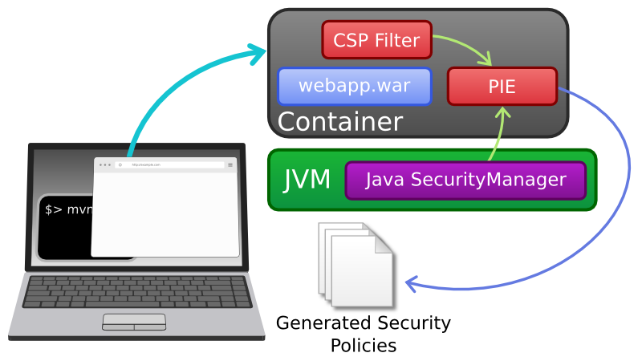
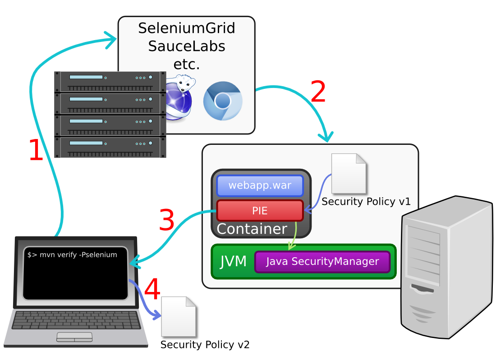

Policy Instantiation and Enforcement (PIE)
==========================================

Introduction
------------

PIE is a framework for creating and managing security policies for Java applications. Most of what follows describes how to use PIE to build a Java [SecurityManager](http://docs.oracle.com/javase/7/docs/api/java/lang/SecurityManager.html) policy specific to your application, which can help protect against many classes of attack. But PIE is also designed to be general, and out-of-the-box also supports generating a policy for CSP ([Content Security Policy](http://www.w3.org/TR/CSP/)), which helps to mitigate XSS. You can also check out the [advanced documentation](docs/ADVANCED.md) for tips on building custom PIE modules for your app.

Quick-Start
-----------

PIE has two primary modes of operation. In report-only mode, PIE will observe permission requests and update its policy so that those requests get whitelisted.

In enforcement mode, PIE reads in its security policies and applies them to any permission requests it sees.

To quickly get started with PIE, just follow these steps:
* Include PIE in your project.
 * If you're using Tomcat, get the [PIE core JAR](https://repo1.maven.org/maven2/com/coverity/security/pie/pie-core/1.0.0/pie-core-1.0.0-with-deps.jar) (this linked version is bundled with all dependencies) and the [PIE security-manager JAR](https://repo1.maven.org/maven2/com/coverity/security/pie/pie-sm/1.0.0/pie-sm-1.0.0.jar) and put them in Tomcat's lib directory.
 * Or, if you're using Maven, just include the PIE security-manager module as a dependency in your application:

        <dependency>
            <groupId>com.coverity.security.pie</groupId>
            <artifactId>pie-sm</artifactId>
            <version>1.0.0</version>
        </dependency>

* Start up your server, use the application, and run any end-to-end tests. Having good application coverage is key, since it lets PIE know what permissions your application will need.
* Shutdown the server. Check out the policy file PIE created: securityManager.policy in the application's root directory. Tweak it if you'd like!
* Create a configuration file for PIE telling it to run in enforcement mode: create a text file your container's working directory or classpath (e.g. Tomcat's lib directory) named pieConfig.properties with the following: `securityManager.isReportOnlyMode = false`
* Start up your server; your application is now protected! Easy as PIE!

Using PIE in Other Containers
-----------------------------

PIE is easiest to use in a Servlet 3.0 container like Jetty or Tomcat (which automatically discover the PIE JARs and start it up on load). However, PIE uses standard Servlet interfaces, so you can load it in just about any container. For example, PIE has a bundle for Dropwizard support; besides including PIE as a dependency, all you need to due is include the PieBundle in your application's initialization method:

    public void initialize(Bootstrap<HelloWorldConfiguration> bootstrap) {
        bootstrap.addBundle(new PieBundle());
        ...
    }
 
Do you use some other container that PIE doesn't support? Open up a feature request, or even better, submit a pull request!

Using the Maven Plugin
----------------------

PIE comes with a Maven plugin which helps you keep your security policies up-to-date and detect issues related to overly-restrictive policies early in the software development lifecycle.

Before you get started, make sure your application server is running in report-only mode, isn't generating its own new version of the policy, and has the PIE admin interface enabled. That is, make sure the server's pieConfig.properties has the following:

    securityManager.isReportOnlyMode = true
    pie.regenerateOnShutdown = false
    pie.admininterface.enabled = true

Now you can run your test build utilizing the PIE Maven plugin.

1. Activate your usual end-to-end testing build. This may call out to a service like SeleniumGrid, or use a browser locally.
2. Your testing build exercises a deployed instance of your web application, which, as indicated above, should be running PIE in a report-only mode.
3. After the test is complete, the PIE Maven plugin fetches all policy violations that occurred from the deployed server.
4. The plugin uses this information to generate an updated policy on your local machine, so you can inspect it, make updates, and redeploy the policy to your testing server. It will also (optionally) fail the Maven build so that you know an update needs to be made.

To include PIE as part of your Maven build, include the plugin in your pom.xml:

    <plugin>
        <groupId>com.coverity.security.pie</groupId>
        <artifactId>pie-maven-plugin</artifactId>
        <version>1.0.0</version>
        <configuration>
            <serverUrl>http://qaserver.myapp.example.com:8080/</serverUrl>
            <pieConfig>pieConfig.properties</pieConfig>
            <failOnViolations>true</failOnViolations>
        </configuration>
        <executions>
            <execution>
                <goals>
                    <goal>build-policy</goal>
                </goals>
            </execution>
        </executions>
    </plugin>

When using PIE this way, make sure your server is configured to use PIE is report-only mode, and that the admin interface is enabled (see below).

The PIE plugin will run during the post-integration phase by default, at which time it will make a call to PIE's admin interface on the server (using the configured server URL) to fetch any policy violations that occurred during the Maven build. It will then update local policy files to add those violations to the whitelist, simplifying the policies if the pieConfig.properties file is configured to do so. If the failOnViolations configuration parameter is set to true (which is the default value), the plugin will also fail the Maven build if there were any violations.

Configuration Options
---------------------

PIE has lots of options to help you use it in the way that's most efficient for you. Here are the options you can include in pieConfig.properties, which you can put in either the root directory of your application, or in the root of your container's classpath (e.g. in Tomcat's lib directory).

    # Global
    pie.enabled = true # Whether or not PIE should be enabled
    pie.regenerateOnShutdown = true # Whether or not PIE should update its policy files
    pie.admininterface.enabled = false # Whether PIE's admin console should be enabled; this is mostly for PIE's Maven plugin
    # SecurityManager
    securityManager.enabled = true # Is the SecurityManager module enabled?
    securityManager.policyPath = file:securityManager.policy # The path where the SecurityManager's policy file will be generated and read from
    securityManager.isReportOnlyMode = true # Is the SecurityManager is report-only mode?
    securityManager.isCollapseEnabled = true # Is policy simplification enabled?
    securityManager.collapseLibDir = true # Should PIE collapse permissions for all the JARs in the webapp's lib directory?

Policy Simplification
---------------------

One of PIE's most useful features is its ability to collapse and simplify your generated security policy. This not only makes it easier for a human to read, understand, and verify, but also allows PIE to make helpful generalizations. For example, consider the following generated policy:

    "file:/home/ihaken/tomcats/pebble/webapps/pebble-2.6.4/WEB-INF/lib/commons-fileupload-1.0.jar": {
       "java.io.FilePermission": {
          "/home/ihaken/tomcats/pebble/temp/upload_00000000.tmp": {
             "delete": {},
             "read": {}
          },
          "/home/ihaken/tomcats/pebble/temp/upload_00000001.tmp": {
             "delete": {},
             "read": {}
          },
          "/home/ihaken/tomcats/pebble/temp/upload_00000002.tmp": {
             "delete": {},
             "read": {}
          },
          ...
If you were to leave `securityManager.isCollapseEnabled = false` in your pieConfig.properties file, this policy would go on for hundreds of lines, and wouldn't even leave you with a correct policy, since it wouldn't allow for arbitrary files in `/home/ihaken/tomcats/pebble/temp` to be read and deleted. But with collapse enabled, PIE will output

    "file:/home/ihaken/tomcats/pebble/webapps/pebble-2.6.4/WEB-INF/lib/commons-fileupload-1.0.jar": {
       "java.io.FilePermission": {
          "/home/ihaken/tomcats/pebble/temp/*": { "delete,read": {} }
       },
       ...

PIE's heuristics for collapsing policies are written in a way that allows them to be context dependent. This means that PIE knows to collapse the file paths to `/home/ihaken/tomcats/pebble/temp/*` and to collapse the "delete" and "read" directives into a single comma-separated-value list "delete,read". This modularity also allows you to tweak the conditions and threshold for collapsing directives. See the [advanced documentation](docs/ADVANCED.md) for more information.

CSP, Custom Modules, and Advanced Configuration
-----------------------------------------------

PIE is a general framework and can be used with more than just the Java SecurityManager. Out-of-the-box PIE supports generating policies for CSP, and includes an example (in the example-webapp directory) of generating a policy for Spring Security to define role-based access rules on DAO methods. See the [advanced documentation](docs/ADVANCED.md) for details!

License
-------

PIE is distributed under the terms of the [Simplified BSD License](https://en.wikipedia.org/wiki/Simplified_BSD_License#2-clause_license_.28.22Simplified_BSD_License.22_or_.22FreeBSD_License.22.29). See [LICENSE](LICENSE).
